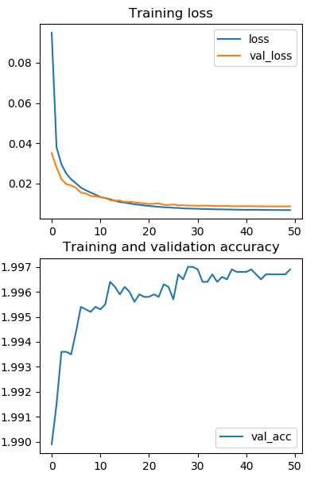

# CapsNet-Pytorch
[](https://github.com/XifengGuo/CapsNet-Keras/blob/master/LICENSE)

A Pytorch implementation of CapsNet in the paper:   
[Sara Sabour, Nicholas Frosst, Geoffrey E Hinton. Dynamic Routing Between Capsules. NIPS 2017](https://arxiv.org/abs/1710.09829)   
The current `average test error = 0.34%` and `best test error = 0.30%`.   
 
**Differences with the paper:**   
- We use the learning rate decay with `decay factor = 0.9` and `step = 1 epoch`,    
while the paper did not give the detailed parameters (or they didn't use it?).
- We only report the test errors after `50 epochs` training.   
In the paper, I suppose they trained for `1250 epochs` according to Figure A.1?
- We use MSE (mean squared error) as the reconstruction loss and 
the coefficient for the loss is `lam_recon=0.0005*784=0.392`.   
This should be **equivalent** to using SSE (sum squared error) and `lam_recon=0.0005` as in the paper.


**TODO**
- Conduct experiments on other datasets. 
- Explore interesting characteristics of CapsuleNet.

**Contacts**
- Your contributions to the repo are always welcome. 
Open an issue or contact me with E-mail `guoxifeng1990@163.com` or WeChat `wenlong-guo`.


## Usage

**Step 1.
Install [Pytorch](https://github.com/pytorch/pytorch) from source**

I'm using the source code of Nov 24, 2017. The newest code should be working too.   
Go https://github.com/pytorch/pytorch for installation instructions.

**Step 2. Clone this repository to local.**
```
git clone https://github.com/XifengGuo/CapsNet-Pytorch.git
cd CapsNet-Pytorch
```

**Step 3. Train a CapsNet on MNIST**  

Training with default settings:
```
python capsulenet.py
```

Launching the following command for detailed usage:
```
python capsulenet.py -h
``` 

**Step 4. Test a pre-trained CapsNet model**

Suppose you have trained a model using the above command, then the trained model will be
saved to `result/trained_model.pkl`. Now just launch the following command to get test results.
```
python capsulenet.py --testing --weights result/trained_model.pkl
```
It will output the testing accuracy and show the reconstructed images.
The testing data is same as the validation data. It will be easy to test on new data, 
just change the code as you want.

You can also just *download a model I trained* from 
https://pan.baidu.com/s/1dFLFtT3


## Results

**Test Errors**   

CapsNet classification test **error** on MNIST. Average and standard deviation results are
reported by 3 trials. The results can be reproduced by launching the following commands.   
 ```
 python capsulenet.py --routings 1 #CapsNet-v1   
 python capsulenet.py --routings 3 #CapsNet-v2
```
   Method     |   Routing   |   Reconstruction  |  MNIST (%)  |  *Paper*    
   :---------|:------:|:---:|:----:|:----:
   Baseline |  -- | -- | --             | *0.39* 
   CapsNet-v1  |  1 | yes | 0.36 (0.016)| *0.29 (0.011)*
   CapsNet-v2  |  3 | yes| 0.34 (0.029) | *0.25 (0.005)*
   
Losses and accuracies:   



**Training Speed**  

About `73s / epoch` on a single GTX 1070 GPU.   
About `43s / epoch` on a single GTX 1080Ti GPU.         

**Reconstruction result**  

The result of CapsNet-v2 by launching   
```
python capsulenet.py --testing --weights result/trained_model.pkl
```
Digits at top 5 rows are real images from MNIST and 
digits at bottom are corresponding reconstructed images.


## Other Implementations
- Keras:   
  - [XifengGuo/CapsNet-Keras](https://github.com/XifengGuo/CapsNet-Keras)   
  
- TensorFlow:
  - [naturomics/CapsNet-Tensorflow](https://github.com/naturomics/CapsNet-Tensorflow.git)   
  I referred to some functions in this repository.
  - [InnerPeace-Wu/CapsNet-tensorflow](https://github.com/InnerPeace-Wu/CapsNet-tensorflow)   
  - [chrislybaer/capsules-tensorflow](https://github.com/chrislybaer/capsules-tensorflow)

- PyTorch:
  - [timomernick/pytorch-capsule](https://github.com/timomernick/pytorch-capsule)
  - [gram-ai/capsule-networks](https://github.com/gram-ai/capsule-networks)
  - [nishnik/CapsNet-PyTorch](https://github.com/nishnik/CapsNet-PyTorch.git)
  - [leftthomas/CapsNet](https://github.com/leftthomas/CapsNet)
  
- MXNet:
  - [AaronLeong/CapsNet_Mxnet](https://github.com/AaronLeong/CapsNet_Mxnet)
  
- Chainer:
  - [soskek/dynamic_routing_between_capsules](https://github.com/soskek/dynamic_routing_between_capsules)

- Matlab:
  - [yechengxi/LightCapsNet](https://github.com/yechengxi/LightCapsNet)